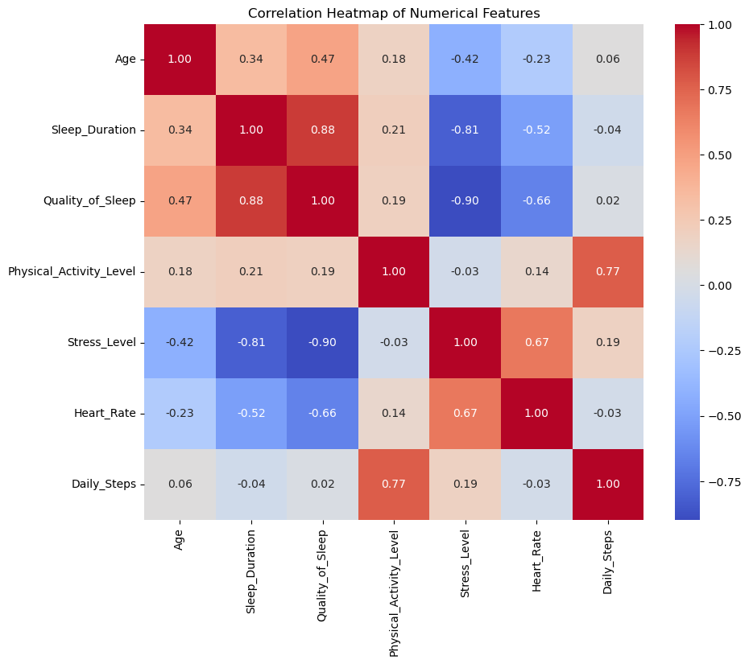
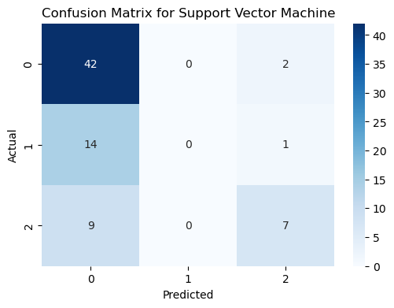
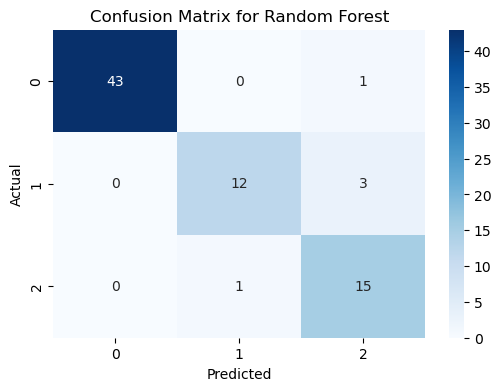

# Sleep Disorder Prediction Model

## Objective
To predict whether a person has a sleep disorder, i.e., sleep apnea or insomnia. The problem addressed is aligned with the UN SDG 3 Health. 

## Data Source
The dataset used was obtained from Kaggle: [Data Source](https://www.kaggle.com/datasets/uom190346a/sleep-health-and-lifestyle-dataset)

## Overview
The dataset consists of 374 rows and 12 columns with a wide range of variables related to sleep and daily habits. They include gender, age, occupation, sleep duration, quality of sleep, physical activity level, stress levels, BMI category, blood pressure, heart rate, daily steps, and the presence or absence of sleep disorders. The target variable is the presence or absence of a sleep disorder.

## Key Findings

There was a strong correlation between:
- quality of sleep and sleep duration
- daily steps and physical activity levels
- stress level and heart rate. 
Additionally, there was a weak correlation between age and quality of sleep.

## Confusion Matrix
1. Support Vector Machine Model

- 

2. Decision Tree Model

- 

3. Random Forest Model

- 